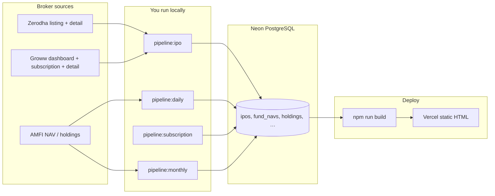
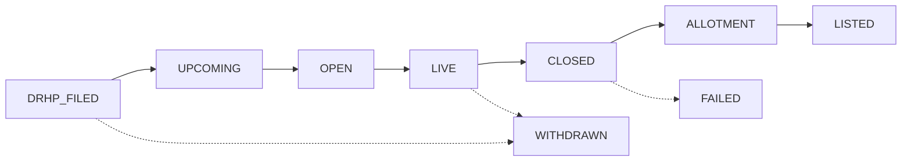

# IPOfins Data Pipeline

## Philosophy

- **Neon PostgreSQL is the source of truth** for all market data (IPOs, NAVs, holdings).
- **Git stores code only** — scraped market data is never committed.
- **Manual pipelines** — you run scripts locally, verify output, then push code (if any) to trigger Vercel build.
- **Authorized sources only** — NSE, BSE, SEBI, AMFI for regulatory data. **Zerodha + Groww** for IPO calendar, dates, subscription, and company detail (bidirectional merge — each source fills gaps in the other).

## GMP removed

Grey Market Premium (GMP) is **not published by any authorized source** (NSE, BSE, SEBI, AMFI). GMP has been removed from the product. The `ipo_gmp_history` table remains in the schema for a possible future licensed feed but is unused.

## Three Pipelines

| # | Script | Frequency | Sources | Writes to |
|---|--------|-----------|---------|-----------|
| 0 | `npm run pipeline:ipo` | Daily / before deploy (manual) | Zerodha + Groww (listing, detail, subscription) | `ipos`, `ipo_subscriptions`, `ipo_performance` |
| 1 | `npm run pipeline:daily` | Daily (manual) | AMFI NAVAll.txt + `pipeline:ipo` (incremental) | `funds`, `fund_navs`, `ipos`, … |
| 2 | `npm run pipeline:subscription` | Hourly during IPO season (manual) | Groww subscription page | `ipo_subscriptions` |
| 3 | `npm run pipeline:monthly` | 1–2× per month (manual) | AMFI portfolio Excel + AMFI TER API | `fund_holdings`, `funds.expense_ratio` → compute signals & overlaps |
| — | GitHub `Quarterly Expense Ratio` workflow | Auto: 1 Jan / Apr / Jul / Oct | AMFI TER API | `funds.expense_ratio` → build → Vercel deploy |

## Workflow

### End-to-end data flow



**CI/Vercel never runs pipelines** — only `npm run build` (reads Neon). Refresh data locally first, then deploy.

### IPO broker sync (`pipeline:ipo`)

1. Optional **clean** — wipe `ipos` + related tables (default on full run).
2. **Fetch** Zerodha listing + Groww dashboard + Groww subscription (parallel).
3. **Merge** bidirectionally — if a field is missing on one source, fill from the other.
4. **Enrich** — Groww detail pages first (DRHP, pros/cons, structured JSON), then Zerodha detail (schedule, description).
5. **Compute status from dates** — never trust broker tab labels; apply lifecycle rules below.
6. **Write** to `ipos`, `ipo_subscriptions`, `ipo_performance`.

Flags: `--no-clean` (incremental upsert), `--quick` (skip closed IPO detail fetches).

### IPO status lifecycle (build + pipeline)

Statuses are **derived from dates**, not stored broker labels:



| Status | Condition |
|--------|-----------|
| `drhp-filed` | No `open_date` yet |
| `upcoming` | `today < open_date − 2 days` |
| `open` | Within 2 days of open; not yet live — CTA: **Opens on [date]** |
| `live` | `open_date ≤ today ≤ close_date` — CTA: **Apply now** |
| `closed` | After `close_date`, before allotment |
| `allotment` | Allotment → listing window |
| `listed` | `today ≥ listing_date` |
| `failed` / `withdrawn` | Manual flags only |

Applied in:
- **Pipeline** — `scripts/lib/ipo-status.mjs` before DB write
- **Site build** — `src/utils/ipo-status.ts` via `withCorrectStatuses()` on every page

### Commands

```bash
# 1. Set DATABASE_URL in .env (Neon connection string)

# Full IPO refresh (wipes IPO tables + Zerodha/Groww fetch)
npm run pipeline:ipo

# Incremental IPO upsert (no wipe)
npm run pipeline:ipo -- --no-clean

# NAV + IPO incremental
npm run pipeline:daily

# During open IPOs — subscription refresh (hourly if needed)
npm run pipeline:subscription

# Monthly — after AMFI publishes new portfolio disclosures
npm run pipeline:monthly

# Build site (verifies Neon schema, then reads DB at build time)
npm run build

# Before deploy: refresh NAV (~12s) + verify DB
npm run predeploy

# Deploy: push to main → GitHub builds with secrets.DATABASE_URL → uploads dist to Vercel
git push origin main
```

## Deploy (recommended — one Neon database)

**Use a single Neon project** for local pipelines and production builds. No separate prod database.

| Where | What to set |
|-------|-------------|
| Local `.env` | `DATABASE_URL` = your Neon pooler URL |
| GitHub → Secrets | Same `DATABASE_URL` (build reads this) |
| Vercel → Env vars | Same `DATABASE_URL` (only if Vercel builds on its own; optional if using GitHub prebuilt deploy) |

### Day-to-day deploy (3 steps)

```bash
npm run predeploy    # ~12s — refresh NAV + verify schema
npm run build        # ~25 min — static pages from Neon
git push origin main # CI: verify → check → build → deploy dist (no Vercel rebuild)
```

### Why this setup

- **Neon** = source of truth (IPOs, NAV, holdings). Git = code only.
- **`pipeline:nav`** (~12s) for daily NAV; **`pipeline:daily`** when IPOs need refresh too.
- **`db:verify`** fails fast if `DATABASE_URL` points at an empty/wrong database.
- **GitHub deploys prebuilt `dist/`** — Vercel does not run a second build with a missing/wrong `DATABASE_URL`.

### If build fails with `relation "ipos" does not exist`

Your `DATABASE_URL` does not match the populated database. Copy the exact string from local `.env` into GitHub Secrets → `DATABASE_URL`.

```bash
npm run db:verify   # should print: Schema OK — N IPOs
```

### Disable duplicate Vercel builds (optional)

If GitHub Actions deploys for you, in Vercel → Project → Settings → Git: disable automatic Production deploys, or ignore Vercel build failures when GitHub already deployed `dist`.

## Vercel Setup

GitHub Actions builds with `secrets.DATABASE_URL` and runs `vercel deploy dist --prod` (prebuilt static files).

If you also connect Vercel to GitHub directly, set the **same** `DATABASE_URL` on Vercel (Production) so any Vercel-native build succeeds too.

## Editorial Data (stays in Git)

These are hand-curated, not scraped:

- `src/data/brokers.json`
- `src/data/articles.json`
- `src/data/tools.json`

## Windows double-click runners

Use the numbered `.bat` files in `finverseui/runners/` (double-click from File Explorer):

| Runner | What it does |
|--------|----------------|
| `1-Monthly-Holdings-Update.bat` | Parse latest month → Neon → signals (incremental) |
| `2-Monthly-Holdings-Full-Reload.bat` | Full reload all months + recompute signals |
| `3-Audit-Database.bat` | Health check: holdings, changes, signals, most bought/sold |
| `4-AMC-Coverage-Report.bat` | Which AMFI AMCs are missing |
| `5-Holdings-By-AMC-Report.bat` | Fund counts per AMC |
| `6-Daily-IPO-Nav-Pipeline.bat` | IPO broker sync + AMFI NAV |
| `7-IPO-Subscription-Pipeline.bat` | Groww subscription refresh |
| `8-Build-Website.bat` | `npm run build` (reads Neon) |
| `9-Test-Database-Connection.bat` | Test DB + row counts |

## Deprecated Scripts

| Old | Replacement |
|-----|-------------|
| `fetch-data` / `fetch-all-data.mjs` | `pipeline:daily` |
| `fetch-gmp-sub` / `fetch-subscription-gmp.mjs` | `pipeline:subscription` (no GMP) |
| `fetch-mf` | Part of `pipeline:daily` (NAV only) |
| `local-fetch-and-push.bat` / `local-sub-gmp-push.bat` | `runners/` folder |

## DB Setup (one-time)

```bash
psql $DATABASE_URL -f db/migrations/001_initial_schema.sql
psql $DATABASE_URL -f db/migrations/002_indexes.sql
psql $DATABASE_URL -f db/migrations/003_materialized_views.sql
```

If migrating from existing JSON:

```bash
npm run db:seed          # one-time import from local JSON files
```

## Super Investors / 1% Club / PMS / Alternative Funds (Migration 005)

Additive schema (migrations 005 + 006) backs four route products sharing one
unified `tracked_entities` table. **Promoters are excluded** from all curated
views — they live only in `shareholding_pattern_holders` with `is_promoter = TRUE`
so we can show "% held by promoters" on stock pages, but never treat them as
conviction signals.

| Route | Entity types | Source |
|-------|--------------|--------|
| `/super-investors` | individual, family_office, fii, dii | NSE/BSE Shareholding Pattern + SAST |
| `/1-percent-club` | all raw ≥1% holders (uncurated) | Full Shareholding Pattern parse |
| `/pms` | PMS providers + their strategies | Provider disclosures + SEBI PMS database |
| `/alternative-funds` | aif (Cat I/II/III) + sif (2024) — two tabs | SAST + SEBI AIF/SIF database |

### Schema (Migration 005 — additive, zero ALTER to existing tables)

```
tracked_entities ─┬─< entity_holdings >── stocks
                  ├─< entity_changes   >── stocks
                  ├─< entity_conviction>── stocks
                  ├─< entity_quarterly_stats
                  ├─< entity_strategies (PMS/SIF only)
                  ├─< tracked_entity_tags
                  └─< entity_overlaps >── tracked_entities (self)
                              ▲
shareholding_pattern_holders >── stocks      (raw ≥1% holders, 1% Club)
sast_filings               >── stocks        (intra-quarter event-driven)
entity_stock_signals       >── stocks        (aggregate smart-money signal)
corporate_actions          >── stocks        (splits/bonuses rebasing)
pipeline_runs                                (run log for /health dashboard)
```

### Setup (one-time, additive)

```bash
psql $DATABASE_URL -f db/migrations/005_super_investors.sql
psql $DATABASE_URL -f db/migrations/006_super_investor_views.sql
npm run db:seed-superinvestors   # load curated rosters from src/data/*.json
```

### Pipelines (manual — same model as the IPO/MF pipelines above)

These four pipelines follow the same manual-local philosophy as `pipeline:ipo`
and `pipeline:daily`: you run them locally, verify the output, then deploy.
There is **no GitHub Actions automation for these pipelines today** — the only
scheduled workflows are `quarterly-expense-ratio.yml` (TER) and the push-to-main
build/deploy (`update-data.yml`). Automation is a documented future task (see
"Roadmap" below).

| # | Command | Cadence | Source | Writes to |
|---|---------|---------|--------|-----------|
| 4 | `npm run pipeline:superinvestor` | Quarterly | NSE/BSE Shareholding Pattern | `shareholding_pattern_holders`, `entity_holdings` |
| 6 | `npm run pipeline:pms` | Quarterly + monthly catch-up | Provider disclosures (6 PMS sites) | `entity_holdings` (with `strategy_id`) |
| 7 | `npm run pipeline:altfunds` | Quarterly | SAST cross-reference + AIF/SIF provider disclosures | `entity_holdings`, `sast_filings` |
| 8 | `npm run pipeline:sast-sweep` | Weekly | NSE/BSE corporate announcements | `sast_filings`, `entity_holdings` (`is_preliminary`) |

> **1% Club** is not a separate pipeline. `/1-percent-club` reads the raw
> `shareholding_pattern_holders` rows that pipeline 04 parses but does **not**
> match to a curated entity — so running `pipeline:superinvestor` refreshes both
> the curated super-investor views *and* the 1% Club in one pass.

#### Common flags

| Flag | Pipelines | Effect |
|------|-----------|--------|
| `--dry-run` | 4, 6, 7, 8 | Fetch + match + log only; **no DB writes** (SAST promotions, upserts, and quality gates are skipped). |
| `--quarter=YYYY-MM-DD` | 4, 6, 7 | Process a specific quarter instead of the inferred current quarter. |
| `--days=N` | 8 | SAST lookback window (default 7). |

```bash
# Example — verify a quarter before writing:
npm run pipeline:superinvestor -- --dry-run --quarter=2026-04-01
```

#### The compute step (run after every holdings refresh)

Each of pipelines 4/6/7 writes raw `entity_holdings` rows. Deriving changes,
signals, conviction, overlaps, and refreshing materialized views is a separate
step you run afterward:

```bash
npm run db:compute-si          # changes + signals + conviction + overlaps + view refresh
npm run db:refresh-si-views    # view refresh only (cheap, safe to re-run anytime)
```

`db:compute-si` is idempotent for a given quarter — re-running it after a
partial fix recomputes that quarter's derived tables cleanly.

#### Overrides (resilience layer)

When NSE/BSE endpoints change or a provider's site breaks, a fetcher returns
`[]`. To keep the products serving data while you investigate, drop a
hand-curated JSON file into `src/data/si-overrides/` and the pipeline merges it
(overrides win on conflict). Supported by pipelines 4, 6, 7 (SAST is
event-driven — an empty result means "no events", so no override):

| Pipeline | File | Row shape |
|----------|------|-----------|
| 4 | `superinvestor-{quarter}.json` | `{ stockSlug, holderName, holderType, shares, pctOfCompany, sourceUrl }` |
| 6 | `pms-{quarter}.json` | `{ providerSlug, strategyName, stockName, nseSymbol, shares, pctOfCompany, sourceUrl }` |
| 7 | `altfunds-{quarter}.json` | `{ entitySlug, stockName, nseSymbol, shares, pctOfCompany, sourceUrl }` |

See `src/data/si-overrides/README.md` for full examples.

### Quality gates

Pipeline 4 (`superinvestor`) is wrapped with a **row-count quality gate**: it
compares this run's `shareholding_pattern_holders` count against the prior
successful run and **aborts (writes nothing)** if the ratio falls below 70%.
The site keeps serving last-known-good data; you investigate and re-run.

Pipelines 6, 7, and 8 currently report `qualityGate: 'skipped'` — they have no
row-count baseline because provider disclosure volumes fluctuate legitimately
between quarters. A consistency check (not a hard abort) is the planned middle
ground. Every run, gated or not, is logged to `pipeline_runs` with status,
counts, and a message for the `/health` dashboard.

### Quarterly cadence (SEBI calendar — Apr/Jul/Oct/Jan, ~25 days after quarter-end)

The intended unattended flow is: fetch → quality gate → compute
changes/signals/conviction/overlaps → refresh views → build → deploy, keeping
the site on last-known-good data if any gate fails. **The GitHub Actions
workflow that orchestrates this is not yet wired** — today the quarterly run is
performed manually by chaining the commands above. Adding the workflow (cron
trigger + the same command chain + quality-gate abort) is a documented roadmap
item, not a regression.

See `/health` dashboard for live run-state, row counts, and staleness alerts.

