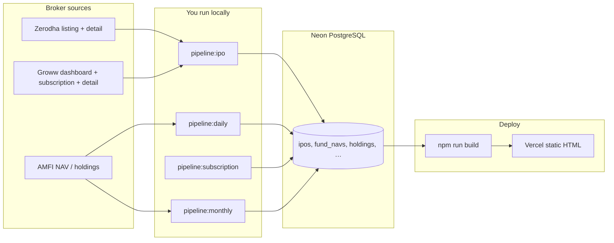
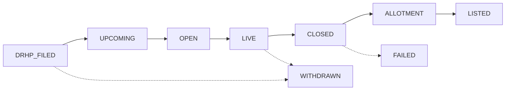

# IPOfins Data Pipeline

## Philosophy

- **Neon PostgreSQL is the source of truth** for all market data (IPOs, NAVs, holdings).
- **Git stores code only** — scraped market data is never committed.
- **Manual pipelines** — you run scripts locally, verify output, then push code (if any) to trigger Vercel build.
- **Authorized sources only** — NSE, BSE, SEBI, AMFI for regulatory data. **Zerodha + Groww** for IPO calendar, dates, subscription, and company detail (bidirectional merge — each source fills gaps in the other).

## GMP removed

Grey Market Premium (GMP) is **not published by any authorized source** (NSE, BSE, SEBI, AMFI). GMP has been removed from the product. The `ipo_gmp_history` table remains in the schema for a possible future licensed feed but is unused.

## Three Pipelines

| # | Script | Frequency | Sources | Writes to |
|---|--------|-----------|---------|-----------|
| 0 | `npm run pipeline:ipo` | Daily / before deploy (manual) | Zerodha + Groww (listing, detail, subscription) | `ipos`, `ipo_subscriptions`, `ipo_performance` |
| 1 | `npm run pipeline:daily` | Daily (manual) | AMFI NAVAll.txt + `pipeline:ipo` (incremental) | `funds`, `fund_navs`, `ipos`, … |
| 2 | `npm run pipeline:subscription` | Hourly during IPO season (manual) | Groww subscription page | `ipo_subscriptions` |
| 3 | `npm run pipeline:monthly` | 1–2× per month (manual) | AMFI portfolio Excel disclosures | `fund_holdings` → compute signals & overlaps |

## Workflow

### End-to-end data flow



**CI/Vercel never runs pipelines** — only `npm run build` (reads Neon). Refresh data locally first, then deploy.

### IPO broker sync (`pipeline:ipo`)

1. Optional **clean** — wipe `ipos` + related tables (default on full run).
2. **Fetch** Zerodha listing + Groww dashboard + Groww subscription (parallel).
3. **Merge** bidirectionally — if a field is missing on one source, fill from the other.
4. **Enrich** — Groww detail pages first (DRHP, pros/cons, structured JSON), then Zerodha detail (schedule, description).
5. **Compute status from dates** — never trust broker tab labels; apply lifecycle rules below.
6. **Write** to `ipos`, `ipo_subscriptions`, `ipo_performance`.

Flags: `--no-clean` (incremental upsert), `--quick` (skip closed IPO detail fetches).

### IPO status lifecycle (build + pipeline)

Statuses are **derived from dates**, not stored broker labels:



| Status | Condition |
|--------|-----------|
| `drhp-filed` | No `open_date` yet |
| `upcoming` | `today < open_date − 2 days` |
| `open` | Within 2 days of open; not yet live — CTA: **Opens on [date]** |
| `live` | `open_date ≤ today ≤ close_date` — CTA: **Apply now** |
| `closed` | After `close_date`, before allotment |
| `allotment` | Allotment → listing window |
| `listed` | `today ≥ listing_date` |
| `failed` / `withdrawn` | Manual flags only |

Applied in:
- **Pipeline** — `scripts/lib/ipo-status.mjs` before DB write
- **Site build** — `src/utils/ipo-status.ts` via `withCorrectStatuses()` on every page

### Commands

```bash
# 1. Set DATABASE_URL in .env (Neon connection string)

# Full IPO refresh (wipes IPO tables + Zerodha/Groww fetch)
npm run pipeline:ipo

# Incremental IPO upsert (no wipe)
npm run pipeline:ipo -- --no-clean

# NAV + IPO incremental
npm run pipeline:daily

# During open IPOs — subscription refresh (hourly if needed)
npm run pipeline:subscription

# Monthly — after AMFI publishes new portfolio disclosures
npm run pipeline:monthly

# Build site (reads from Neon at build time)
npm run build

# Deploy (push to main → Vercel build with DATABASE_URL env var)
git push origin main
```

## Vercel Setup

Add `DATABASE_URL` to Vercel project environment variables (Production + Preview). The Astro build queries Neon at build time to generate static pages.

## Editorial Data (stays in Git)

These are hand-curated, not scraped:

- `src/data/brokers.json`
- `src/data/articles.json`
- `src/data/tools.json`

## Windows double-click runners

Use the numbered `.bat` files in `finverseui/runners/` (double-click from File Explorer):

| Runner | What it does |
|--------|----------------|
| `1-Monthly-Holdings-Update.bat` | Parse latest month → Neon → signals (incremental) |
| `2-Monthly-Holdings-Full-Reload.bat` | Full reload all months + recompute signals |
| `3-Audit-Database.bat` | Health check: holdings, changes, signals, most bought/sold |
| `4-AMC-Coverage-Report.bat` | Which AMFI AMCs are missing |
| `5-Holdings-By-AMC-Report.bat` | Fund counts per AMC |
| `6-Daily-IPO-Nav-Pipeline.bat` | IPO broker sync + AMFI NAV |
| `7-IPO-Subscription-Pipeline.bat` | Groww subscription refresh |
| `8-Build-Website.bat` | `npm run build` (reads Neon) |
| `9-Test-Database-Connection.bat` | Test DB + row counts |

## Deprecated Scripts

| Old | Replacement |
|-----|-------------|
| `fetch-data` / `fetch-all-data.mjs` | `pipeline:daily` |
| `fetch-gmp-sub` / `fetch-subscription-gmp.mjs` | `pipeline:subscription` (no GMP) |
| `fetch-mf` | Part of `pipeline:daily` (NAV only) |
| `local-fetch-and-push.bat` / `local-sub-gmp-push.bat` | `runners/` folder |

## DB Setup (one-time)

```bash
psql $DATABASE_URL -f db/migrations/001_initial_schema.sql
psql $DATABASE_URL -f db/migrations/002_indexes.sql
psql $DATABASE_URL -f db/migrations/003_materialized_views.sql
```

If migrating from existing JSON:

```bash
npm run db:seed          # one-time import from local JSON files
```
