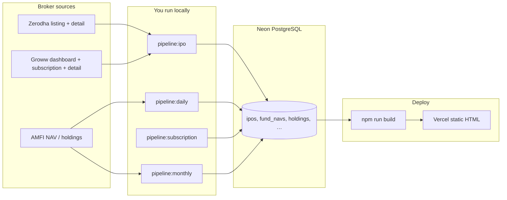
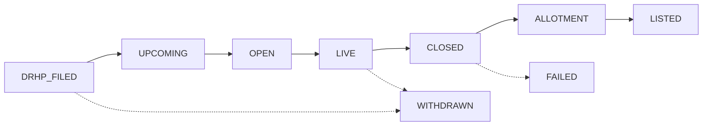

# IPOfins Data Pipeline

> **Full reference (all pipelines, CI workflows, duplicates):** [docs/PIPELINES.md](docs/PIPELINES.md)

## Philosophy

- **Neon PostgreSQL is the source of truth** for all market data (IPOs, NAVs, holdings).
- **Git stores code only** — scraped market data is never committed.
- **Automated pipelines** run on GitHub Actions (see workflows below); you can also run the same scripts locally.
- **Authorized sources only** — NSE, BSE, SEBI, AMFI for regulatory data. **Zerodha + Groww** for IPO calendar, dates, subscription, and company detail (bidirectional merge — each source fills gaps in the other).

## GMP removed

Grey Market Premium (GMP) is **not published by any authorized source** (NSE, BSE, SEBI, AMFI). GMP has been removed from the product. The `ipo_gmp_history` table remains in the schema for a possible future licensed feed but is unused.

## Core pipelines (summary)

| # | Script | Frequency | Sources | Writes to |
|---|--------|-----------|---------|-----------|
| 0 | `npm run pipeline:ipo` | Manual | Zerodha + Groww | `ipos`, `ipo_subscriptions`, `ipo_performance` |
| 1 | `npm run pipeline:daily` | Daily (manual) | AMFI NAV + IPO quick sync | `funds`, `fund_navs`, `ipos`, … |
| 2 | `npm run pipeline:subscription` | Hourly during IPO season | Groww subscription | `ipo_subscriptions` |
| 5 | `npm run pipeline:ipo-performance` | Daily (in cron) | Yahoo Finance daily close | `ipo_performance` (post-listing prices) |
| — | `npm run pipeline:predeploy` | Before deploy | NAV + IPO quick + subscription + post-listing prices + verify | Same as above |
| 3 | `npm run pipeline:monthly` | 1–2× per month | AMFI holdings Excel + TER | `fund_holdings`, signals, overlaps |
| 4 | `npm run pipeline:superinvestor` | Quarterly / backfill | NSE/BSE SHP | `shareholding_pattern_holders`, `entity_holdings` |
| — | `npm run pipeline:cron:daily` | **Auto: weekdays 9 AM IST** | AMFI NAV + Zerodha/Groww IPO (full detail) + subscription | `funds`, `fund_navs`, `ipos`, … |
| — | `npm run pipeline:cron:monthly` | **Auto: 15th, 6 AM IST** | MF holdings + TER + SAST sweep + SAST JSON | `fund_holdings`, `sast_filings`, signals |
| — | `npm run pipeline:cron:quarterly` | **Auto: 28 Jan/Apr/Jul/Oct, 6 AM IST** (post-SHP window) | SHP fetch + SI signals + export | `shareholding_pattern_holders`, `entity_holdings` |
| 8 | `npm run pipeline:sast-sweep` | Monthly (in cron) | NSE/BSE SAST | `sast_filings` (DB) |
| — | GitHub **Weekly SAST Updates** | Manual only (emergency) | SAST JSON export | `public/data/sast-updates*.json` |

## Workflow

### End-to-end data flow



**CI/Vercel** runs `npm run build` on every deploy. Scheduled workflows refresh Neon first, then build + deploy.

### GitHub Actions workflows (manual trigger via Actions tab)

| Workflow | Schedule (IST) | What it runs |
|----------|----------------|--------------|
| **Pipeline Daily** | Mon–Fri 9:00 AM | `pipeline:cron:daily` → build → Vercel |
| **Pipeline Monthly** | 15th 6:00 AM | `pipeline:cron:monthly` → build → Vercel |
| **Pipeline Quarterly Super Investors** | 28 Jan/Apr/Jul/Oct 6:00 AM (after SHP filing window) | `pipeline:cron:quarterly` → build → Vercel |
| **Build & Deploy** | Push to `main` | Build only (optional pipelines on manual dispatch) |
| **Weekly SAST Updates** | Manual only | Mid-month SAST JSON refresh without MF holdings |

### IPO broker sync (`pipeline:ipo`)

1. Optional **clean** — wipe `ipos` + related tables (default on full run).
2. **Fetch** Zerodha listing + Groww dashboard + Groww subscription (parallel).
3. **Merge** bidirectionally — if a field is missing on one source, fill from the other.
4. **Enrich** — Groww detail pages first (DRHP, pros/cons, structured JSON), then Zerodha detail (schedule, description).
5. **Compute status from dates** — never trust broker tab labels; apply lifecycle rules below.
6. **Write** to `ipos`, `ipo_subscriptions`, `ipo_performance`.

Flags: `--no-clean` (incremental upsert), `--quick` (skip closed IPO detail fetches).

### IPO post-listing prices (`pipeline:ipo-performance`)

Populates the post-listing columns on `ipo_performance` (`current_price`, `price_1w`,
`price_1m`, `price_3m`, `price_6m`, `price_1y`, `return_1m_pct`, `return_1y_pct`) that
power the **"Price Since Listing"** section on the IPO detail page.

1. Select listed IPOs (`listing_date ≤ today`, `listing_price` present).
2. Resolve each to a traded symbol: **stocks master** (ISIN/NSE/BSE/name) → **Yahoo
   Finance search** by company name (name-checked so a wrong hit never writes prices).
3. Fetch the daily close series (Yahoo `chart` API), then read the close **as of**
   `listing_date + {1w, 1m, 3m, 6m, 1y}` plus the latest close (`current_price`).
4. Returns are computed against the issue price. Milestones still in the future, or
   points with no nearby trade (illiquid SME guard), stay `null` — the UI hides them.

Non-destructive `UPDATE` on existing `ipo_performance` rows. Runs automatically in the
daily cron and pre-deploy pipeline; run standalone with `-- --dry-run` to preview.

### IPO status lifecycle (build + pipeline)

Statuses are **derived from dates**, not stored broker labels:



| Status | Condition |
|--------|-----------|
| `drhp-filed` | No `open_date` yet |
| `upcoming` | `today < open_date − 2 days` |
| `open` | Within 2 days of open; not yet live — CTA: **Opens on [date]** |
| `live` | `open_date ≤ today ≤ close_date` — CTA: **Apply now** |
| `closed` | After `close_date`, before allotment |
| `allotment` | Allotment → listing window |
| `listed` | `today ≥ listing_date` |
| `failed` / `withdrawn` | Manual flags only |

Applied in:
- **Pipeline** — `scripts/lib/ipo-status.mjs` before DB write
- **Site build** — `src/utils/ipo-status.ts` via `withCorrectStatuses()` on every page

### Commands

```bash
# 1. Set DATABASE_URL in .env (Neon connection string)

# Full IPO refresh (wipes IPO tables + Zerodha/Groww fetch)
npm run pipeline:ipo

# Incremental IPO upsert (no wipe)
npm run pipeline:ipo -- --no-clean

# NAV + IPO incremental
npm run pipeline:daily

# During open IPOs — subscription refresh (hourly if needed)
npm run pipeline:subscription

# Monthly — after AMFI publishes new portfolio disclosures
npm run pipeline:monthly

# Build site (verifies Neon schema, then reads DB at build time)
npm run build

# Before deploy: refresh NAV (~12s) + verify DB
npm run predeploy

# Deploy: push to main → GitHub builds with secrets.DATABASE_URL → uploads dist to Vercel
git push origin main
```

## Deploy (recommended — one Neon database)

**Use a single Neon project** for local pipelines and production builds. No separate prod database.

| Where | What to set |
|-------|-------------|
| Local `.env` | `DATABASE_URL` = your Neon pooler URL |
| GitHub → Secrets | Same `DATABASE_URL` (build reads this) |
| Vercel → Env vars | Same `DATABASE_URL` (only if Vercel builds on its own; optional if using GitHub prebuilt deploy) |

### Day-to-day deploy (3 steps)

```bash
npm run predeploy    # ~12s — refresh NAV + verify schema
npm run build        # ~25 min — static pages from Neon
git push origin main # CI: verify → check → build → deploy dist (no Vercel rebuild)
```

### Why this setup

- **Neon** = source of truth (IPOs, NAV, holdings). Git = code only.
- **`pipeline:nav`** (~12s) for daily NAV; **`pipeline:daily`** when IPOs need refresh too.
- **`db:verify`** fails fast if `DATABASE_URL` points at an empty/wrong database.
- **GitHub deploys prebuilt `dist/`** — Vercel does not run a second build with a missing/wrong `DATABASE_URL`.

### If build fails with `relation "ipos" does not exist`

Your `DATABASE_URL` does not match the populated database. Copy the exact string from local `.env` into GitHub Secrets → `DATABASE_URL`.

```bash
npm run db:verify   # should print: Schema OK — N IPOs
```

### Disable duplicate Vercel builds (optional)

If GitHub Actions deploys for you, in Vercel → Project → Settings → Git: disable automatic Production deploys, or ignore Vercel build failures when GitHub already deployed `dist`.

## Vercel Setup

GitHub Actions builds with `secrets.DATABASE_URL` and runs `vercel deploy dist --prod` (prebuilt static files).

If you also connect Vercel to GitHub directly, set the **same** `DATABASE_URL` on Vercel (Production) so any Vercel-native build succeeds too.

## Editorial Data (stays in Git)

These are hand-curated, not scraped:

- `src/data/brokers.json`
- `src/data/articles.json`
- `src/data/tools.json`

## Windows double-click runners

Use the numbered `.bat` files in `finverseui/runners/` (double-click from File Explorer):

| Runner | What it does |
|--------|----------------|
| `1-Monthly-Holdings-Update.bat` | Parse latest month → Neon → signals (incremental) |
| `2-Monthly-Holdings-Full-Reload.bat` | Full reload all months + recompute signals |
| `3-Audit-Database.bat` | Health check: holdings, changes, signals, most bought/sold |
| `4-AMC-Coverage-Report.bat` | Which AMFI AMCs are missing |
| `5-Holdings-By-AMC-Report.bat` | Fund counts per AMC |
| `6-Daily-IPO-Nav-Pipeline.bat` | IPO broker sync + AMFI NAV |
| `7-IPO-Subscription-Pipeline.bat` | Groww subscription refresh |
| `8-Build-Website.bat` | `npm run build` (reads Neon) |
| `9-Test-Database-Connection.bat` | Test DB + row counts |

## Deprecated Scripts

| Old | Replacement |
|-----|-------------|
| `fetch-data` / `fetch-all-data.mjs` | `pipeline:daily` |
| `fetch-gmp-sub` / `fetch-subscription-gmp.mjs` | `pipeline:subscription` (no GMP) |
| `fetch-mf` | Part of `pipeline:daily` (NAV only) |
| `local-fetch-and-push.bat` / `local-sub-gmp-push.bat` | `runners/` folder |

## DB Setup (one-time)

```bash
psql $DATABASE_URL -f db/migrations/001_initial_schema.sql
psql $DATABASE_URL -f db/migrations/002_indexes.sql
psql $DATABASE_URL -f db/migrations/003_materialized_views.sql
```

If migrating from existing JSON:

```bash
npm run db:seed          # one-time import from local JSON files
```
